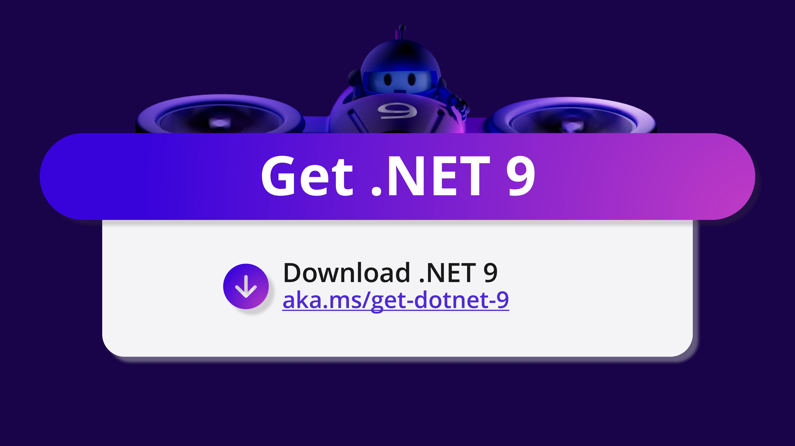

# MyHome-DotNetConf-2020

How I used .NET 9 and AI to charge my electric car based on the available solar power - .NET Conf 2024

## Resources

* [MyHome source code repository](https://github.com/Djohnnie/MijnThuis)
* [Modbus Sunspec implementation for SolarEdge inverters source code repository](https://github.com/Djohnnie/Djohnnie.SolarEdge.ModBus.TCP)
* [Modbus Sunspec implementation for SolarEdge inverters NuGet package](https://www.nuget.org/packages/Djohnnie.SolarEdge.ModBus.TCP/)
* [Solar forecast service](https://forecast.solar/)
* [Microsoft Semantic Kernel](https://learn.microsoft.com/en-us/semantic-kernel/overview/)
* [Microsoft Semantic Kernel source code repository](https://github.com/microsoft/semantic-kernel)
* [Learn about Azure OpenAI](https://learn.microsoft.com/en-us/azure/ai-services/openai/overview)
* [Learn about Speech to Text](https://learn.microsoft.com/en-us/azure/ai-services/speech-service/speech-to-text)

## Slidedeck

